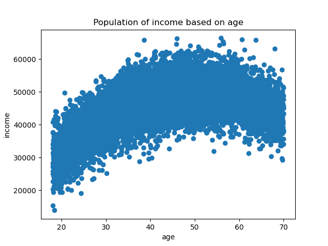
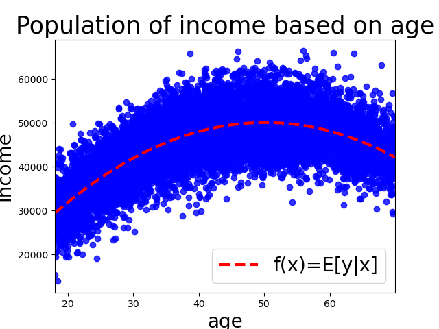
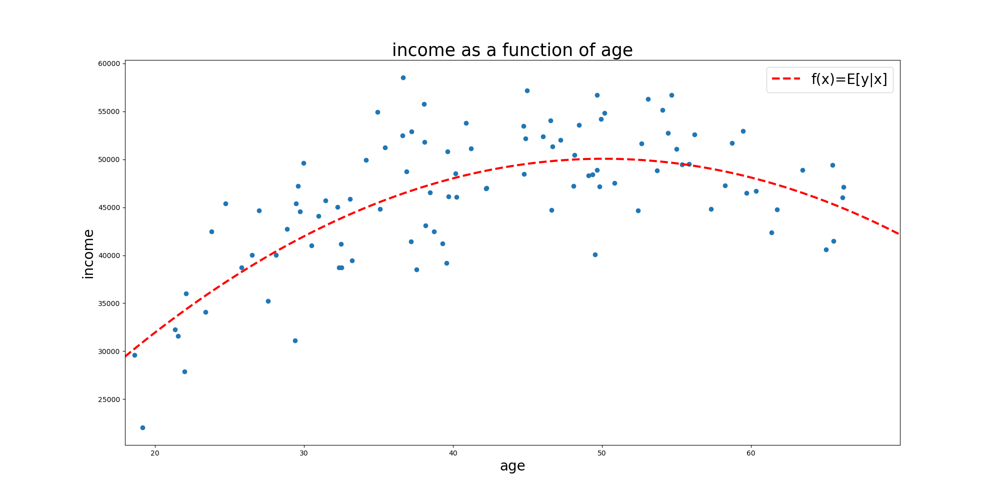
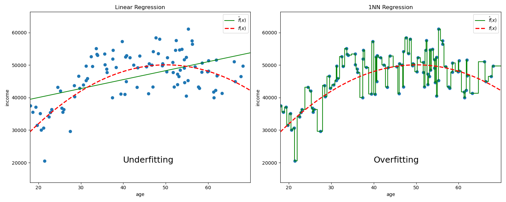

---
title:
- Empirical Evaluation of Management Practices I
subtitle:
- Predictions and Machine Learning
author:
- Prof. Dr. Dirk Sliwka
- Jesper Armouti-Hansen
date:
- 17/11/20
theme:
- Copenhagen
---

# Content
1. Introduction to Machine Learning
2. Regression
3. Classification
4. Model Selection and Assessment
5. Decision Trees and Random Forests

# 1. Introduction to Machine Learning
## General definition
_[Machine Learning is the] field of study that gives computers the ability to learn without being explicitly programmed._

- (Arthur Samuel, 1959)

## More specific definition
_A computer program is said to learn from experience $E$ with respect to some task $T$ and some performance measure $P$, if its performance on $T$, as measured by $P$, improves with experience $E$._

- (Tom Mitchell, 1997)

# Examples of ML/AI in business
+ Employee attrition prediction
+ Recruiting automation
+ Customer churn modeling
+ Recommendation engines

# Types of Machine Learning
**Supervised Learning:**

The task of learning a function that maps the input(s) $X$ to an output $y$ based on example input-output pairs.

+ Regression: The output is continuous or discrete and ordered.
	+ Example: Predicting house prices based on house characteristics.
+ Classification: The output is a discrete and unordered set.
	+ Example: Classifying an email as spam or ham based on the use of certain words.

_This is a "mini-course" on supervised learning with Python._

#
**Unsupervised Learning:**

We observe inputs but no output. We can seek to understand the relationship between the variables or the observations.

+ For example, we might observe multiple characteristics for potential customers.
	+ We can then try to cluster potential customers into groups based on these characteristics
+ We might also try to project our inputs into a lower dimensional space.
	+ This can be a beneficial preprocessing for supervised learning when dealing with high-dimensional data.

_We will not deal with unsupervised learning in this course._

# Terminology
_The terms used in the ML literature differs slightly from that used in Econometrics:_

+ Supervised learning → _Regression, classification, predicting $y_i$ given $x_i$._
+ Features → $x_i$_, independent variables, explanatory variables, regressors, predictors._
+ Target → $y_i$_, dependent variable._
+ Training → _Estimating a model._
+ Testing → _Evaluating a model._
+ Training data → _The sample we use to train our model._
+ Test data → _The sample we use to test our model._

# 2. Regression
Let us start with an example:

+ Suppose our task is to predict income based on a person's age and that we had data on the whole population:

<center>
{ width=60% }
</center>

+ What would be a "good" prediction here?

# More formally

+ Let $X_i$ be a random vector (i.e. the vector of features).
+ Let $Y_i$ be a real variable (i.e. the response).
+ We are interested in a function $f(X_i)$ which makes "good" prediction about $Y_i$.
+ To know what a "good" prediction is, we require a loss function: $L(Y_i,f(X_i))$ which penalizes bad predictions
	+ Common choice: Squared error -- penalizes the quadratic distance:
\begin{equation}
L(Y_i , f(X_i)) = (Y_i - f(X_i))^2
\end{equation}

#
Recall from the lecture on Part 2:

::: {.block}
## CEF Prediction Property
Let $f(X_i)$ be any function of $X_i$. The conditional expectation function (CEF) solves:
\begin{equation}
E[Y_i | X_i] = \arg\min_{f(X_i)}E[(Y_i - f(X_i))^2]
\end{equation}
:::

+ Thus, in terms of prediction, we can do no better than the CEF
+ Also, recall:

::: {.block}
## CEF Decomposition Property
We can decompose $Y_i$ such that
\begin{equation}
Y_i = E[Y_i | X_i] + \epsilon_i
\end{equation}
Where:

1. $\epsilon_i$ is mean independent of $X_i$: $E[\epsilon_i|X_i]=0$.
2. $\epsilon_i$ is uncorrelated with any function of $X_i$.
:::

#
Thus, if we knew the population, calculating the CEF is usually not a difficult task:
<center>
{ width=60% }
</center>

We just predict the average income for people of the same age.

+ In this case, we are dealing with simulated data with the following conditional expectation function:
	\begin{equation}
	f(income)=2000*age - 20*age^2
	\end{equation}

#
Usually, we do not know the whole population. Rather, we are working with a sample.

+ In this example, we will be working with a sample of 100 data points.
+ Our goal is to construct a model $\hat{f}(age)$ which makes "good" predictions about income
<center>
{ width=100% }
</center>

# Estimating $f$ - K Nearest Neighbor (KNN) Regression
The CEF ($f$) is almost always unknown, so how can we estimate it?

+ For a given observation $x_i$, we could approximate the CEF by predicting the average of $Y_i$ across observations with $X_i=x_i$.
+ Problem?
	+ We might have very few or no other observations with $X_i=x_i$
+ Instead, we can settle with predicting the average of $Y_i$ of the $K$ nearest known neighbors of $x_i$:
	\begin{equation}
	\hat{f}(x_i)=\frac{1}{K}\sum_{j\in N_K}y_j
	\end{equation}
	+ Where $N_K$ is a neighborhood containing the indices of the $K$ closest $x$'s.

# Estimating $f$ - Linear Regression
Another way to estimate the CEF is to assume that it is approximately linear in its arguments:
\begin{equation}
\hat{f}(x_i)=\hat{\beta}_0 + \hat{\beta}_1 x_{i1} + \hat{\beta}_2 x_{i2} + \dots + \hat{\beta}_k x_{ik}
\end{equation}

+ Thus, estimating the CEF amounts to finding the $\beta$'s that minimize the squared error in the sample.

+ _We now know of two machine learning models: KNN and Linear Regression!_

# Example
Let us return to our example:
<center>
{ width=100% }
</center>


# Underfitting vs. Overfitting
In order to make predictions based on our sample, suppose we train two models:
A simple linear regression:

1. $\hat{f}(age_i)=\hat{\beta}_0+\hat{\beta}_1 age_i$
2. A KNN regression with $K=1$
{ width=100% }
Clearly, the linear regression is too inflexible and the 1NN regression is too flexible to properly approximate the CEF.

#
The simple linear regression makes bad predictions because it underfits our training data:

+ It has high bias and low variance.

The 1NN regression makes bad predictions because it overfits our training data:

+ It has low bias and high variance.

Thus, when dealing with predictions, we face a trade-off:

+ The Bias-Variance trade-off

Essentially, we want to find a model that has low bias and low variance, if possible.

# The Bias-Variance trade-off

More formally, given a realized point $x_0$, the expected squared error is given by:

\begin{equation}
E[(y_0 - \hat{f}(x_0))^2]= Var[\hat{f}(x_0)] + [f(x_0) - E[\hat{f}(x_0)]]^2 + \sigma^2_{\epsilon}
\end{equation}

The first term is the variance of our model at $x_0$, the second the squared bias at $x_0$, and the third is the irreducible error.

# Introduction to Sci-kit Learn (sklearn)
## Linear Regression in sklearn
+ To fit a linear regression model on the data X and y, we first import the module:
```python
	from sklearn.linear_model import LinearRegression
```

+ Then we can perform a regression with the following code:
```python
	reg = LinearRegression().fit(X,y)
```

+ We can access one of its attributes to get the coefficients:
```python
	reg.coef_
```
+ Suppose the regression is given by $\hat{f}(x_i)=\hat{\beta}_0 + \hat{\beta_1}*age + \hat{\beta}_2*age^2$ and that I would like to get the prediction for a 20 year old person:
```python
	reg.predict([[20, 20**2]])[0]
```

#
## KNN Regression in sklearn
+ To fit a KNN regression model on the data X and y, we first import the module:
```python
	from sklearn.neighbors import KNeighborsRegressor
```

+ Then we can perform a regression with the following code:
```python
	knn = KneighborsRegressor().fit(X,y)
```

+ Again, suppose we want the prediction of a 20 year old person:
```python
	knn.predict([[20]])[0]
```

## Drawing a random sample with pandas
+ Suppose we would like a random sample of 50 observations from a pandas dataframe `df`:
```python
	df_sample = df.sample(n=50, random_state=181)
```

# Your tasks
1. Import the income dataset as a pandas dataframe. It is located at https://raw.githubusercontent.com/armoutihansen/
EEMP2020/main/datasets/income.csv
2. Create a new column in the dataframe "age_sq" that takes the squared values of the age variable.
3. Since the CEF can now be estimated by a linear regression, draw a random sample of 100 observations and fit a linear regression on the sample. Are the coefficients close to those given by the CEF?
4. Write a loop that generates a new sample 100 times of 100 observations and fit a linear regression on each of the 100 samples. Store the coefficients of the model in each loop.
5. Calculate the mean of each coefficient. Are the means close to the coefficients given in the CEF?

# Your tasks*
6. Consider the observation $age=50$. What is the conditional expectation of income at that age?
7. Drop the "age_sq" variable from the dataframe and write a loop that generates a new sample 100 times of 100 observations. On each sample, fit a 1NN regression and store its income prediction of a person aged 50 in each sample.
8. Calculate the mean of the predictions and plot the distribution of the predictions. What does this tell you about the 1NN's bias and variance on this dataset?
