---
title:
- Empirical Evaluation of Management Practices I
subtitle:
- Predictions and Machine Learning
author:
- Prof. Dr. Dirk Sliwka
- Jesper Armouti-Hansen
date:
- 17/11/20
theme:
- Copenhagen
---

# Content
1. Introduction to Machine Learning
2. Regression
3. Classification
4. Model Selection and Assessment
5. Decision Trees and Random Forests

# 1. Introduction to Machine Learning
## General definition
_[Machine Learning is the] field of study that gives computers the ability to learn without being explicitly programmed._

- (Arthur Samuel, 1959)

## More specific definition
_A computer program is said to learn from experience $E$ with respect to some task $T$ and some performance measure $P$, if its performance on $T$, as measured by $P$, improves with experience $E$._

- (Tom Mitchell, 1997)

# Examples of ML/AI in business
+ Employee attrition prediction
+ Recruiting automation
+ Customer churn modeling
+ Recommendation engines

# Types of Machine Learning
**Supervised Learning:**

The task of learning a function that maps the input(s) $X$ to an output $y$ based on example input-output pairs.

+ Regression: The output is continuous or discrete and ordered.
	+ Example: Predicting house prices based on house characteristics.
+ Classification: The output is a discrete and unordered set.
	+ Example: Classifying an email as spam or ham based on the use of certain words.

_This is a "mini-course" on supervised learning with Python._

#
**Unsupervised Learning:**

We observe inputs but no output. We can seek to understand the relationship between the variables or the observations.

+ For example, we might observe multiple characteristics for potential customers.
	+ We can then try to cluster potential customers into groups based on these characteristics
+ We might also try to project our inputs into a lower dimensional space.
	+ This can be a beneficial preprocessing for supervised learning when dealing with high-dimensional data.

_We will not deal with unsupervised learning in this course._

# Terminology
_The terms used in the ML literature differs slightly from that used in Econometrics:_

+ Supervised learning → _Regression, classification, predicting $y_i$ given $x_i$._
+ Features → $x_i$_, independent variables, explanatory variables, regressors, predictors._
+ Target → $y_i$_, dependent variable._
+ Training → _Estimating a model._
+ Testing → _Evaluating a model._
+ Training data → _The sample we use to train our model._
+ Test data → _The sample we use to test our model._

# 2. Regression
Let us start with an example:

+ Suppose our task is to predict income based on a person's age and that we had data on the whole population:

<center>
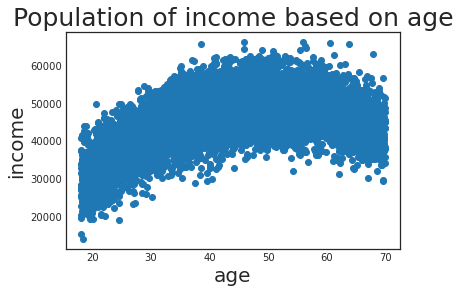{ width=60% }
</center>

+ What would be a "good" prediction here?

# More formally

+ Let $X_i$ be a random vector (i.e. the vector of features).
+ Let $Y_i$ be a real variable (i.e. the response).
+ We are interested in a function $f(X_i)$ which makes "good" prediction about $Y_i$.
+ To know what a "good" prediction is, we require a loss function: $L(Y_i,f(X_i))$ which penalizes bad predictions
	+ Common choice: Squared error -- penalizes the quadratic distance:
\begin{equation}
L(Y_i , f(X_i)) = (Y_i - f(X_i))^2
\end{equation}

#
Recall from the lecture on Part 2:

::: {.block}
## CEF Prediction Property
Let $f(X_i)$ be any function of $X_i$. The conditional expectation function (CEF) solves:
\begin{equation}
E[Y_i | X_i] = \arg\min_{f(X_i)}E[(Y_i - f(X_i))^2]
\end{equation}
:::

+ Thus, in terms of prediction, we can do no better than the CEF
+ Also, recall:

::: {.block}
## CEF Decomposition Property
We can decompose $Y_i$ such that
\begin{equation}
Y_i = E[Y_i | X_i] + \epsilon_i
\end{equation}
Where:

1. $\epsilon_i$ is mean independent of $X_i$: $E[\epsilon_i|X_i]=0$.
2. $\epsilon_i$ is uncorrelated with any function of $X_i$.
:::

#
Thus, if we knew the population, calculating the CEF is usually not a difficult task:
<center>
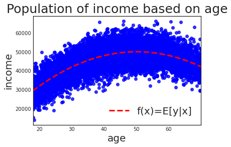{ width=60% }
</center>

We just predict the average income for people of the same age.

+ In this case, we are dealing with simulated data with the following conditional expectation function:
	\begin{equation}
	f(income)=2000*age - 20*age^2
	\end{equation}

#
Usually, we do not know the whole population. Rather, we are working with a sample.

+ In this example, we will be working with a sample of 100 data points.
+ Our goal is to construct a model $\hat{f}(age)$ which makes "good" predictions about income
<center>
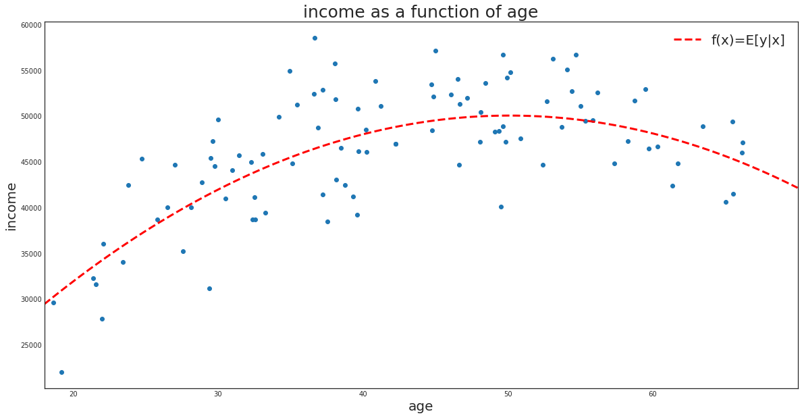{ width=100% }
</center>

# Estimating $f$ - K Nearest Neighbor (KNN) Regression
The CEF ($f$) is almost always unknown, so how can we estimate it?

+ For a given observation $x_i$, we could approximate the CEF by predicting the average of $Y_i$ across observations with $X_i=x_i$.
+ Problem?
	+ We might have very few or no other observations with $X_i=x_i$
+ Instead, we can settle with predicting the average of $Y_i$ of the $K$ nearest known neighbors of $x_i$:
	\begin{equation}
	\hat{f}(x_i)=\frac{1}{K}\sum_{j\in N_K}y_j
	\end{equation}
	+ Where $N_K$ is a neighborhood containing the indices of the $K$ closest $x$'s.

# Estimating $f$ - Linear Regression
Another way to estimate the CEF is to assume that it is approximately linear in its arguments:
\begin{equation}
\hat{f}(x_i)=\hat{\beta}_0 + \hat{\beta}_1 x_{i1} + \hat{\beta}_2 x_{i2} + \dots + \hat{\beta}_k x_{ik}
\end{equation}

+ Thus, estimating the CEF amounts to finding the $\beta$'s that minimize the squared error in the sample.

+ _We now know of two machine learning models: KNN and Linear Regression!_

# Example
Let us return to our example:
<center>
{ width=100% }
</center>


# Underfitting vs. Overfitting
In order to make predictions based on our sample, suppose we train two models:
A simple linear regression:

1. $\hat{f}(age_i)=\hat{\beta}_0+\hat{\beta}_1 age_i$
2. A KNN regression with $K=1$
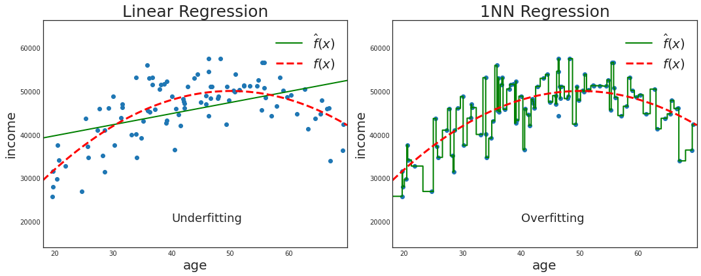{ width=100% }
Clearly, the linear regression is too inflexible and the 1NN regression is too flexible to properly approximate the CEF.

#
The simple linear regression makes bad predictions because it underfits our training data:

+ It has high bias and low variance.

The 1NN regression makes bad predictions because it overfits our training data:

+ It has low bias and high variance.

Thus, when dealing with predictions, we face a trade-off:

+ The Bias-Variance trade-off

Essentially, we want to find a model that has low bias and low variance, if possible.

# The Bias-Variance trade-off

More formally, given a realized point $x_0$, the expected squared error is given by:

\begin{equation}
E[(y_0 - \hat{f}(x_0))^2]= Var[\hat{f}(x_0)] + [f(x_0) - E[\hat{f}(x_0)]]^2 + \sigma^2_{\epsilon}
\end{equation}

The first term is the variance of our model at $x_0$, the second the squared bias at $x_0$, and the third is the irreducible error.

# Introduction to Sci-kit Learn (sklearn)
## Linear Regression in sklearn
+ To fit a linear regression model on the data X and y, we first import the module:
```python
	from sklearn.linear_model import LinearRegression
```

+ Then we can perform a regression with the following code:
```python
	reg = LinearRegression().fit(X,y)
```

+ We can access one of its attributes to get the coefficients:
```python
	reg.coef_
```
+ Suppose the regression is given by $\hat{f}(x_i)=\hat{\beta}_0 + \hat{\beta_1}*age + \hat{\beta}_2*age^2$ and that I would like to get the prediction for a 20 year old person:
```python
	reg.predict([[20, 20**2]])[0]
```

#
## KNN Regression in sklearn
+ To fit a KNN regression model on the data X and y, we first import the module:
```python
	from sklearn.neighbors import KNeighborsRegressor
```

+ Then we can perform a regression with the following code:
```python
	knn = KneighborsRegressor().fit(X,y)
```

+ Again, suppose we want the prediction of a 20 year old person:
```python
	knn.predict([[20]])[0]
```

## Drawing a random sample with pandas
+ Suppose we would like a random sample of 50 observations from a pandas dataframe `df`:
```python
	df_sample = df.sample(n=50, random_state=181)
```

# Your tasks
1. Import the income dataset as a pandas dataframe. It is located at https://raw.githubusercontent.com/armoutihansen/
EEMP2020/main/datasets/income.csv
2. Create a new column in the dataframe "age_sq" that takes the squared values of the age variable.
3. Since the CEF can now be estimated by a linear regression, draw a random sample of 100 observations and fit a linear regression on the sample. Are the coefficients close to those given by the CEF?
4. Write a loop that generates a new sample 100 times of 100 observations and fit a linear regression on each of the 100 samples. Store the coefficients of the model in each loop.
5. Calculate the mean of each coefficient. Are the means close to the coefficients given in the CEF?

# Your tasks*
1. Consider the observation $age=50$. What is the conditional expectation of income at that age?
2. Drop the "age_sq" variable from the dataframe and write a loop that generates a new sample 100 times of 100 observations. On each sample, fit a 1NN regression and store its income prediction of a person aged 50 in each sample.
3. Calculate the mean of the predictions and plot the distribution of the predictions. What does this tell you about the 1NN's bias and variance on this dataset?

# 3. Classification
Let us start with an example:

+ Suppose our task is to predict whether a person defaults on her debt based on her income and creadit card balance. Again, suppose we had data on the whole population:

<center>
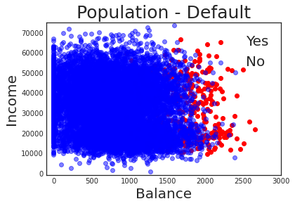{ width=60% }
</center>

+ What would be a good prediction here?

# More formally
Suppose there are $B$ classes. We wish to estimate a "good" classifier $f(X_i)$ that assigns a class label to any observation $X_i$.

+ To know what a "good" prediction is, we require a loss function: $L(Y_i , f(X_i))$ which penalizes bad predictions.
	+ Common choice: Misclassification rate:
		\begin{equation}
		L(Y_i , f(X_i)) =
		\begin{cases}
		1 & \quad \text{if } f(X_i) \neq Y_i\\
		0 & \quad \text{otherwise}
		\end{cases}
		\end{equation}

#
::: {.block}
## Bayes' Optimal Classifier (BOC)

+ Let $p_b(x_i) = Pr(Y_i = b|X_i = x_i), b=1,\dots ,B$
+ Suppose we knew this conditional probability.
+ Then the _Bayes' optimal classifier_ (BOC) at any $x_i$ is given by:
	\begin{equation}
	f(x_i) = b \quad \text{ iff}\quad p_b(x_i) = \max\{p_1(x_i),\dots ,p_B(x_i)\}
	\end{equation}
:::

+ In other words, for any observation, predict that it belongs to its most likely class.
+ Notice that we are utilizing the conditional probability distribution in a similar way to how we utilized the conditional expectation function for regression problems.

#

+ If we knew the population, calculating the BOC is often not a difficult task:

<center>
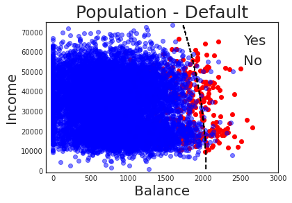{ width=60% }
</center>

We calculate the conditional probability of defaulting at any point and then predict the class with the highest probability.

+ The dotted line is called the decision boundary.

#
Usually, we do not know the whole population. Rather, we are working with a sample.

+ In this example, we will be working with a sample of 1000 data points.
+ Our goal is to construct a classifier $\hat{f}(income,balance)$ which makes "good" predictions about whether a person defaults.

<center>
{ width=60% }
</center>

# Estimating $f$ - K Nearest Neighbor (KNN) Classifier

The BOC ($f$) is almost always unknown, so how can we estimate it?

+ We could approximate the conditional probabilities by calculating the relative frequency for all $B$ classes for $x_i$.
+ Then we predict the class with the highest approximate conditional probability.
+ Problem?
	+ We might have very few or no other observations with $X_i=x_i$.

#
+ Instead, we can settle with estimating the conditional probabilities $p_b(x_i), b=1,\dots ,B$ using the $K$ nearest known neighbors of $x_i$:
	\begin{equation}
	\hat{p}_b(x_i)=\frac{1}{K}\sum_{j\in N_K}y_j
	\end{equation}

	+ Where $N_K$ is a neighborhood containing the indices of the $K$ closest $x$'s.
+ Finally, we predict that $x_i$ belongs to the class with the highest estimated conditional probability:
	\begin{equation}
	\hat{f}(x_i) = b \quad \text{ iff}\quad \hat{p}_b(x_i) = \max\{\hat{p}_1(x_i),\dots ,\hat{p}_B(x_i)\}
	\end{equation}

# Estimating $f$ - Linear Regression
If $B=2$, we can convert the classes into 0's and 1's and perform linear regression to estimate the conditional probabilities.

+ For example, _default_ $=1$ and _no default_ $=0$.

Then we can treat the output of the linear regression as the conditional probability of the class that has been converted to 1's.

+ For example, $\hat{p}_{default}(x_i)=\hat{\beta}_0 + \hat{\beta}_1 * income_i + \hat{\beta}_2 * balance_i$

Finally, we classify $x_i$ to the class with the highest estimated conditional probability.

+ For example,
\begin{equation}
\hat{f}(x_i) =
\begin{cases}
\text{default} & \quad \text{if } \hat{p}_{default}(x_i)>0.5\\
\text{no default} & \quad \text{otherwise}
\end{cases}
\end{equation}

#
Note that that there are some drawbacks with using linear regression for classification:

+ We might get conditional probability estimates below 0 and above 1.
+ When B>2, linear regression imposes cardinality assumptions on the classes.

Because of these points, other models are often preferred such as logistic regression.

# Example
Let us return to our example:

<center>
{ width=60% }
</center>

# Underfitting vs. Overfitting
In order to make predictions based on our sample, suppose we train two models:

1. A linear regression: $\hat{p}_{default}(x_i)=\hat{\beta}_0 + \hat{\beta}_1 * income_i + \hat{\beta}_2 * balance_i$
2. A KNN regression with $K=1$

<center>
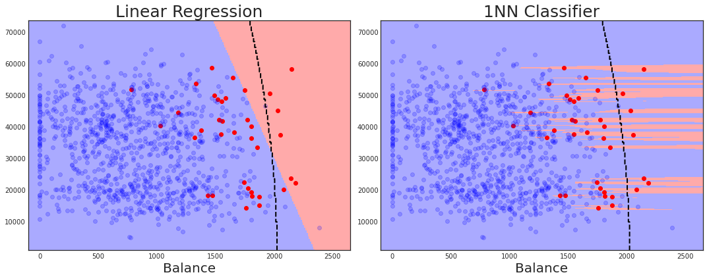{ width=90% }
</center>

Clearly, the linear regression is too inflexible and the 1NN regression is too flexible to properly approximate the BOC.

# Logistic Regression
Logistic regression is a classification method that is more appropriate than linear regression when there are more than two classes and tends to perform better than KNN regression with high-dimensional data.

+ Here we introduce the method applied to our example, but the intuition holds in the general case with more than two classes.
+ To avoid probabilities outside $[0,1]$, we estimate $p_{default}(x_i)$ using the sigmoid function:

<center>
{ width=50% }
</center>

#
+ Applying the sigmoid function implies estimating the conditional probability as follows:
	\begin{equation}
	\hat{p}_{default}(x_i) = \frac{exp(\hat{\beta}_0 + \hat{\beta}_1 * income_i + \hat{\beta_2} * balance_i)}{1 + exp(\hat{\beta}_0 + \hat{\beta}_1 * income_i + \hat{\beta_2} * balance_i)}
	\end{equation}
+ We then classify $x_i$ as default if this estimated conditional probability is larger than 0.5.
+ Note that the decision boundary is the set of points: $\{x_i|\hat{p}_{default}=0.5\}$ which is equivalent to $\{x_i|\hat{\beta}_0 + \hat{\beta}_1 * income_i + \hat{\beta_2} * balance_i=0\}$.

# Example
+ Fitting a logistic regression to our sample gives us:
	+
\begin{table}[]
\begin{tabular}{lllll}
          &                          &     & True                     &       \\ \hline
          & \multicolumn{1}{l|}{}    & No  & \multicolumn{1}{l|}{Yes} & Total \\ \hline
Predicted & \multicolumn{1}{l|}{No}  & 963 & \multicolumn{1}{l|}{37}  & 1000  \\
          & \multicolumn{1}{l|}{Yes} & 0   & \multicolumn{1}{l|}{0}   & 0     \\ \hline
          & Total                    & 963 & 37                       & 1000
\end{tabular}
\end{table}

+ This table is called the "Confusion Matrix".
+ Thus, on our sample, we predict with an accuracy of 96.3%.
+ Notice also that the we only make on type of error:
	+ Predicting "No default" for people that do in fact default.

# Types of Errors

+ **False positive rate (FPR)**: fraction of negative examples classified as positive:
	+ Here: 0%
+ **True positive rate (TPR)**: fraction of positive examples classified as positive:
	+ Here: 0%
+ **False negative rate (FNR)**: fraction of positive examples classified as negative:
	+ Here: 37/37 = 100%
+ **True negative rate (TNR)**: fraction of negative examples classified as negative:
	+ Here: 963/963 = 100%
+ If we vary the threshold of classification, we can increase TPR at the cost of increasing FNR.


# Introduction to Sci-kit Learn (sklearn)

::: {.block}
## KNN Classification in sklearn
+ To fit a KNN Classifier on the data X and y, we first import the module:
```python
	from sklearn.neighbors import KNeighborsClassfier
```

+ Then we can perform a classification with the following code:
```python
	clf = KNeighborsClassifier(n_neighbors=n).fit(X,y)
```
:::


## Logistic Regression in sklearn
+ To fit a KNN Classifier on the data X and y, we first import the module:
```python
	from sklearn.linear_model import LogisticRegression
```

+ Then we can perform a classification with the following code:
```python
	clf = LogisticRegression().fit(X,y)
```

# Introduction to Sci-kit Learn (sklearn)

::: {.block}
## Classifier accuracy in sklearn
+ To get the classifiers accuracy (1-misclassification rate) after having fitted the model, first get the predictions on the sample (or population)
```python
	pred = clf.predict(X)
```

+ Then import the accuracy score function and apply it appropriately:
```python
	from sklearn.metrics import accuracy_score
	print(accuracy_score(pred, y))
```
:::

## Confusion matrix in sklearn
+ To get the confusion matrix after having fitted the model, first get the predictions on the sample (or population)
```python
	pred = clf.predict(X)
```

+ Then import the matrix function and apply it appropriately:
```python
	from sklearn.metrics import confusion_matrix
	print(confusion_matrix(pred, y))
```
# Your tasks
1. Import the income dataset as a pandas dataframe. It is located at https://raw.githubusercontent.com/armoutihansen/
EEMP2020/main/datasets/Default.csv
2. Draw a random sample consisting of 1000 observations. Fit a logistic regression on the sample and get its accuracy score, TPR as well as its FNR on this sample.
3. Fit 20 KNN classifiers on the sample, where K ranges from 1 to 20. For each classifier, store its accuracy on the sample. Which K gives you the highest accuracy? Explain why.
4. Now get the accuracy score of the logistic regression you estimated in 2. and the best KNN regression from 3. on the whole dataframe (i.e. the population). Which of the two has the highest accuracy?
5. Argue whether the best classifier you identified in 4. makes good predictions. In particular, compare the accuracy score to a "stupid" classifier that always predicts the majority class.


# 4. Model Selection and Assesment
Assessment of the general performance (or general error) of our predictive model is what we truly care about. The general performance of a model refers to its prediction ability on independent test data.

+ Or, more generally, its predictive capability on the population.

A model's capability on the training data is often a biased estimate of its general performance.

+ Why?

If we can estimate models' general performance, we:

1. Can select the optimal model for our problem;
2. Know how well this optimal model can predict on the population.

# Types of errors
_Note: We will consider the regression setting here in which the performance is evaluated using the squared error. However, the intuition also holds for the classification setting._

+ The _training_ error of a model $\hat{f}$ trained on a _training_ sample $T$ is simply the mean squared error in that sample:
	\begin{equation}
	MSE = \frac{1}{N}\sum_{i=1}^{N}(y_i - \hat{f}(x_i))^2
	\end{equation}
+ The _test_ error is the expected squared error of our model for a new observation drawn from the population, conditional on being trained on the training sample $T$:
	\begin{equation}
	Err_T = E[(Y_0 - \hat{f}(X_0))^2|T]
	\end{equation}

#
+ Finally, the _expected test_ error is the expected error for a new observation over everything that is random - including the training sample $T$:
	\begin{equation}
	Err = E[E[(Y_0 - \hat{f}(X_0))^2|T]]=E[(Y_0-\hat{f}(X_0))^2]
	\end{equation}

# Goals
Often our model will have one or more hyperparameters.

+ For example, the number $K$ in KNN regression is a hyperparameter.

Hyperparameters are parameters of our model not learned during estimation.

+ Thus, the $\beta$'s in a linear regression are **not** hyperparameters.

Our goal is to select a "good" model along with its optimal hyperparameter(s) and to know how well this model predicts. More formally, our goal is two-fold:

1. **Model Selection**: Estimating the performance of different models and their corresponding hyperparameters in order to choose the best one.
2. **Model Assessment**: Having chosen a final model, estimating its _test error_.

# Validation-Set Approach (without model selection)
**Idea**: _Estimate the test error by holding out observations from our sample._

<center>
{ width=90% }
</center>

**Approach:**

1. Randomly divide the sample into two parts: A training set and a validation or hold-out set.
2. The model is fitted on the training set, and the fitted model is used to predict the target for the for the observations in the validation set.
3. The resulting validation-set mean squared error provides an unbiased estimate of the *test error*.

# Validation-Set Approach (with model selection)
**Idea:** Same idea as before, but now we hold out two sets of observations from our sample. One for model selection and the other for model assessment.

**Approach:**

1. Randomly divide the sample into three parts: A training set $(\sim 50\%)$, a validation set $(\sim 25\%)$, and a test set $(\sim 25\%)$.
2. The models are fitted on the training set, and the fitted models are used to predict the target for the for the observations in the validation set.
3. The model with the lowest estimated error is used to predict the target for the observations in the test set.

# Introduction to Sci-kit Learn (sklearn)
- Suppose we have a data frame `df` consisting of two columns, $X$ and $y$.
- the dataset has 50,000 observations, and we would like a random training set consisting of 25,000 and a test set consisting of 25,000 observation.

### Creating Training, Validation and Test Sets in sklearn
- To do this, we first import the train_test_split module:

```python
from sklearn.model_selection import train_test_split
```

- Then we create our training and test data:

```python
X_train, X_test, y_train, y_test = train_test_split(
df['X'], df['y'], train_size=0.5, random_state=181)
```
- If we also would like a validation set (for model selection), we can split our test data:
```python
X_val, X_test, y_val, y_test = train_test_split(
X_test, y_test, train_size=0.5, random_state=181)
```

# K-fold Cross Validation (CV)
The validation-set approach has an obvious drawback: Results may heavily depend on the chosen split.

- To mediate this, we typically employ K-fold Cross Validation (CV).

__Approach:__

1. Randomly split the data into $K$ roughly equal-sized parts (folds)
2. For each $k=1,...,K$:
    - Leave out part $k$ and fit the model using the other $K-1$ part
    - Calculate the mean squared error of model $k$ on the held out data (i.e. part $k$)
    - Store this mean squared error as $MSE_k$


3. The average of the $K$ MSEs provides an estimate of the *expected test error*:
$$CV(\hat{f})=\frac{1}{K}\sum_{k=1}^{K}MSE_k$$

# Choosing hyper parameters with CV
- Often we consider a class of models with one or more hyper parameters.
    - E.g., # of neighbors in a KNN regressor
- Denote by $MSE_k^\alpha$ the mean squared error on the $k-th$ fold of a model with hyper parameter(s) $\alpha$ fitted $K-1$ parts of the data.
- Then, the average of the $K$ $MSE_k^{\alpha}$ provides an estimate of the test error of $\hat{f}$ with hyper parameter(s) $\alpha$:
$$CV(\hat{f},\alpha)=\frac{1}{K}\sum_{k=1}^{K}MSE_{k}^{\alpha}$$

#
- We can then try out multiple $\alpha$ a pick the one that has the minimum error.
- However, often we employ the so-called "one standard error rule":
	- *Choose the simplest model with error no more than one standard error above the best error.*

# Leave-Out-One CV (LOOCV)
If $K=N$, we are performing a Leave-Out-One CV (LOOCV).

- LOOCV is an approximately unbiased estimate of $Err$ (i.e. low bias) since each $K$ parts contain $N-1$ observations.


However, LOOCV can suffer from high variance:

- We are averaging over $N$ fitted models with almost identical observations.
- Thus, our outputs will be highly positively correlated with each other.


Additionally, LOOCV can be very computationally expensive since we are fitting $N$ models.

# Which value of $K$ should we choose?
We have seen that $K=N$ is approximately biased, but can suffer from high variance.

- The optimal choice of $K$ depends on the slope of the learning curve (displayed below)

<center>
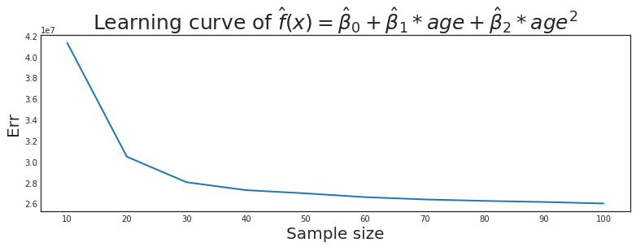{ width=100% }
</center>

#
We want to pick a $K$ such that the learning capability is close to its full capability.

- If we pick a $K$ where the learning curve is steep, our estimate will be biased.
- However, the learning curve is unknown, so 5- or 10-fold CV are recommended as a good comprise between bias and variance.

# Choosing hyper parameters with CV
- Often we consider a class of models with one or more hyper parameters.
    - E.g., # of neighbors in a KNN regressor
- Denote by $MSE_k^\alpha$ the mean squared error on the $k-th$ fold of a model with hyper parameter(s) $\alpha$ fitted $K-1$ parts of the data.
- Then, the average of the $K$ $MSE_k^{\alpha}$ provides an estimate of the test error of $\hat{f}$ with hyper parameter(s) $\alpha$:
$$CV(\hat{f},\alpha)=\frac{1}{K}\sum_{k=1}^{K}MSE_{k}^{\alpha}$$


#
- We can then try out multiple $\alpha$ a pick the one that has the minimum error.
- However, often we employ the so-called "one standard error rule":
	- *Choose the simplest model with error no more than one standard error above the best error.*

# Example
Let us go back to the problem of predicting an individual's income as a function of his/her age.

- Suppose we wish to employ linear regression, but we want to use CV to find the optimal polynomial degree of our regression.
- The CV error estimates for polynomial degree of 0 to 9 are given in the plot below.

<center>
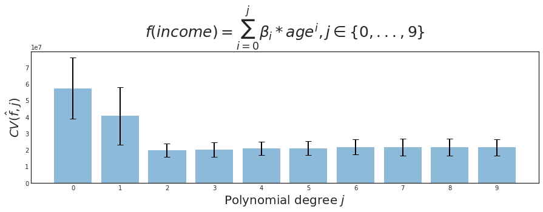{ width=100% }
</center>

# Drawbacks of CV
Recall that in the validation-set approach: Using the validation set for both model selection and model assessment risks underestimating the true test error of the best model.

- The same is true for CV. In fact, it is true in the example we went through here.
- So what can we do about this problem?


Most common approaches:

- Leave out a test set before conducting CV. Then fit the best model to all $K$ parts of the training data and test its performance on the test data.
- Nested CV - The outer CV serves as model assessment and on each fold we perform an inner CV for model selection.


# Introduction to Sci-kit Learn

::: {.block}
## Mean Squared Error (MSE) in sklearn
+ To get the regressor's MSE after having fitted the model, first get the predictions on the sample (or population)
```python
	pred = reg.predict(X)
```

+ Then import the MSE function and apply it appropriately:
```python
	from sklearn.metrics import mean_squared_error
	print(mean_squared_error(pred, y))
```
:::

## Standard CV in sklearn
- To use CV in sklearn, we first import the class as well as the class of the estimator we wish to use (e.g. KNN regression):
```python
from sklearn.model_selection import cross_val_score
from sklearn.neighbors import KNeighborsRegressor
```
- Then we can perform 5-fold CV as follows:
```python
knn_cv = cross_val_score(KNeighborsRegressor(), X, y,
cv=5, scoring='neg_mean_squared_error')
```

# Introduction to Sci-kit Learn

## GridSearchCV in sklearn
- To use GridSearchCV, we first import the class as well as the class of the estimator we wish to use (e.g. KNN regression):
```
from sklearn.model_selection import GridSearchCV
from sklearn.neighbors import KNeighborsRegressor
```
- Then we create a parameter grid as a dictionary with the hyperparameters we want to optimize over. For example, with a KNN regression:
```
param_grid = {'n_neighbors': np.arange(1,50)}
```
- Now we can perform our CV using GridSearchCV and specifying: 'estimator', 'parameter grid', '# of cv folds', 'scoring rule':
```
knn_grid = GridSearchCV(KNeighborsRegressor(), param_grid,
cv=5, scoring='neg_mean_squared_error').fit(X,y)
```

#
## GridSearchCV in sklearn (cont'd)
- NOTE: we have to use negative MSE when we apply GridSearchCV!
- We can get the best estimator and its score, respectively, as follows:
```
knn_grid.best_estimator_
knn_grid.best_score_*-1
```

# Your tasks
1. Import the income data into a pandas dataframe.
2. Draw a random sample of 1000 observations. Furthermore, split the sample into a training set and a validation set.
3. Fit a simple linear regression on the training set and calculate its MSE on the validation set. Afterwards fit the linear regression on the whole sample and calculate its MSE on the whole dataframe. Are the two estimates close? Why/why not?
4. Now fit a simple linear regression on the original sample using 5-fold CV. Get the estimate test MSE. Is it close to the MSE on the whole dataset than the estimate in 3.? Why/why not?
5. Finally, use Gridsearch CV to fine the optimal KNN regressor on the sample and get its estimated test MSE.

# 5. Decision Trees and Random Forests
Decision trees are versatile ML algorithms that can perform both classification and regression tasks.

- A decision tree is a tree-based method - this involves stratifying or segmenting the feature space into a number of simple regions.
- After this split, we typically make predictions based on the mean or mode response value in the regions.
- The set of splitting rules used to segment the feature space can be summarized in a tree.
- Decisions trees are the fundamental components of *Random Forests* which are among the most powerful ML algorithms available.

# Example
Here we perform a decision tree regression on our income data, where we restrict the depth of the tree:

<center>
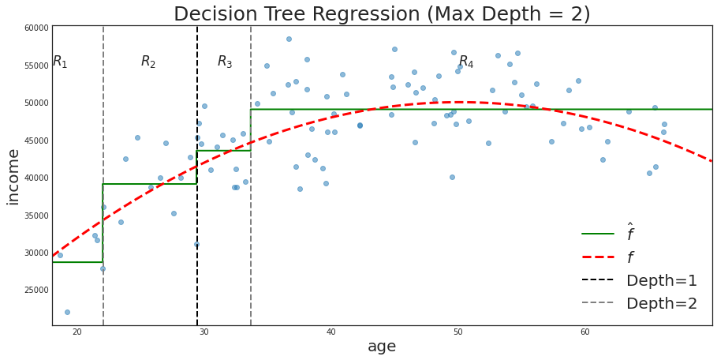{ width=100% }
</center>

# Example (Cont'd)
- Here the same regression visualized as a tree:

<center>
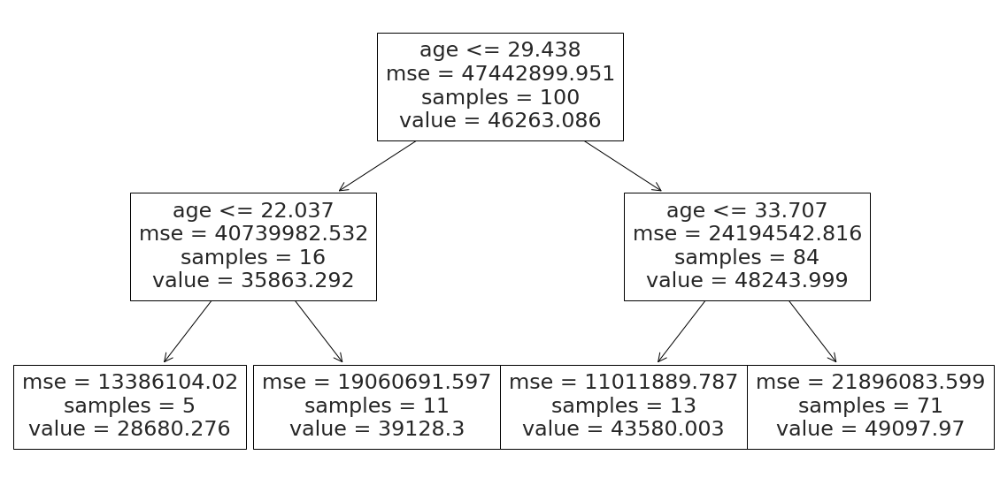{ width=100% }
</center>

# Terminology
- The regions (e.g., $R_1,R_2,R_3,R_4$) are known as the _leaves of the three_ (or _terminal nodes_ ).
- The points along the three where the feature space is split (e.g., age<=22.037) are known as _internal nodes_.
- The _initial node_ (e.g., age <= 29.438) is also sometimes referred to as the _root node_.
- The segments of the three that connects the nodes are called _branches_.
- Note: The three is usually displayed upside down.

# The optimal regression tree
How do we estimate regression threes?

1. We divide the feature space $X_i$ into $J$ distinct and non-overlapping regions $R_1,...,R_J$
2. For every observation that lies in $R_j$, we predict the mean of the $y_i$ of the observations in $R_j$.

For example, if an individuals age is below 22, then we would predict an income of 28,680.28.

#
But how do we divide the feature space into $J$ regions?

- Optimally, we find the $J$ regions $R_1,...,R_J$ that minimizes
$$ \sum_{j=1}^{J}\frac{N_j}{N}\frac{1}{N_j}\sum_{i\in R_j}(y_i-\hat{y}_{R_j})² = \sum_{j=1}^{J}\frac{N_j}{N} MSE_j$$
- Where $\hat{y}_{R_j}$ is the mean $y_i$ for training observations within region $R_j$.
- In other words: the $J$ regions that minimizes the weighted mean squared error.

# The alternative
Unfortunately, that division approach is computationally infeasible. Instead we apply a _top-down, greedy_ approach known as _recursive binary splitting_ :

- Step 1: We split the feature space into two regions in a way that minimizes the resulting weighted mean squared error.
    - That is, we split the space such that we minimize:
    $$ \frac{N_1}{N}\frac{1}{N_1}\sum_{i\in R_1}(y_i-\hat{y}_{R_1})² + \frac{N_2}{N}\frac{1}{N_2}\sum_{i\in R_2}(y_i-\hat{y}_{R_2})²$$
- We iterate this step with its regions, until we have $J$ regions.

With the optimization in place, one question remains: _How do we choose $J$?_

# Example
If we do not restrict $J$, the algorithm will run until no further improvements can be made.

- However, not restricting $J$ will most likely result in overfitting as shown on our income data below:

<center>
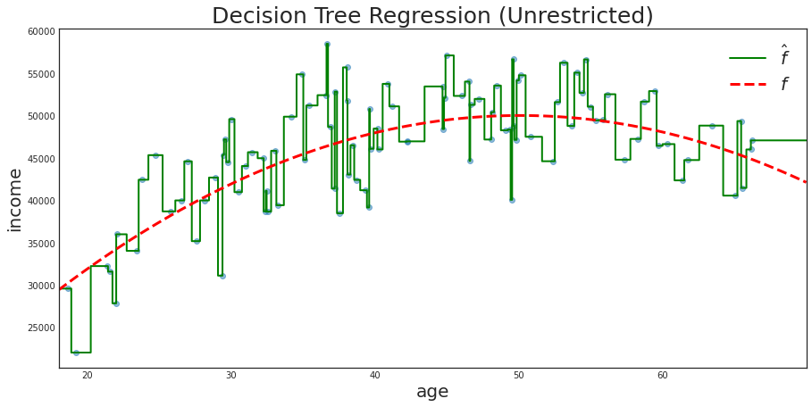{ width=90% }
</center>

# How to avoid overfitting
There are different ways to overcome the overfitting problem of decision trees:

1. Cost Complexity Pruning (CCP): We grow the largest tree possible (as above) and then we find the optimal subtree that minimizes a loss function with a penalty term increasing in the size of the tree.
2. Create a range for different criteria such as _maximum depth_ and _minimum samples per leaf_. Then employ CV for each of the possible values to find the optimal model.

As CCP is not yet a possibility in the stable version of Sci-Kit Learn, we will use the second method here.

# Introduction to Sci-kit Learn
## Decision trees in sklearn
- To perform a decision tree regression in sci-kit learn, we first import the class:
```
from sklearn.tree import DecisionTreeRegressor
```
- Then we can train the model on our X and y, while specifying the maximum depth:
```
reg = DecisionTreeRegressor(max_depth=2).fit(X,y)
```
- To evaluate its performance on our test set, we follow the standard method:
```
from sklearn.metrics import mean_squared_error as MSE
y_pred_test = reg.predict(test_X)
print('test mse:', MSE(test_y, y_pred_test))
```
- Finally, if we would like to display our fitted tree, we can do as follows:
```
from sklearn import tree
tree.plot_tree(reg, feature_names=['age'],
class_names='income');
```

# Bootstrap Aggregating
Suppose there is a slightly biased coin: 51% chance of heads and 49% tails.

- Naturally, any given toss of the coin may come up tails, but what is the probability that the majority of our tosses will be heads if we keep tossing it?
- Formally, we can answer this question using the binomial distribution, but the plot below to the left immediately gives us the answer:

#
<center>
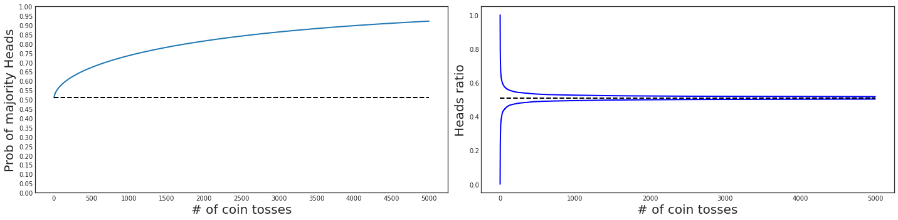{ width=100% }
</center>

Thus, if we are allowed to keep on tossing the coin, the majority of tosses will be heads almost surely

- This is because the law of large numbers dictates that the heads ratio must go towards 0.51, as the right plot shows.

# Voting Regression
We can use this insight from classification and use it for regression as well.

- In the example below, we have combined the linear regression, 10NN regression, and the decision tree regression with maximum depth of 2 into a voting regressor.

<center>
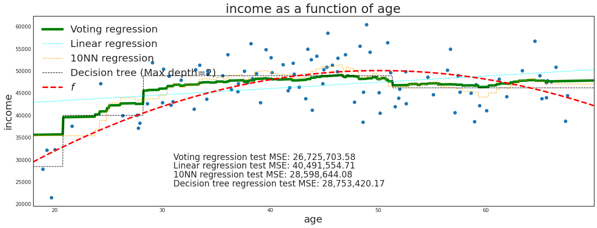{ width=90% }
</center>

- That is, for any given age, we simply predict the average of the three regressors predictions.

# Bagging
As we saw above, we can combine diverse regressors into one powerful regressor. However, usually we do not have access to very many diverse regressors, so we cannot fully take advantage of the law of large numbers.

- Instead, we can use many instances of the same regressor on different instances of our training data.
- In particular, we take $n$ random samples of some specified size from our training data with replacement (this is called _bagging_ or _bootstrap aggregating_ ).
- Then, we make $n$ "copies" of our regressor and train each of them on one of the random samples.
- Our final prediction at any point is then just the average prediction of our $n$ regressors.

# Example
For example, recall that the unrestriction decision tree was a _weak_ regressor on our income data.

- This is because it tends to overfit our training data and therefore has high variance.
-
We can take 1000 random samples of size 50 from our 100 training data points (with replacement).

- Then, we make 1000 copies of an unrestricted decision tree regressor and train each of them on one of the samples.
    - In essence, what we are doing is trading of higher bias with lower variance.

As we can see below, the result is a much better fit to the conditional expectation function $f$.

#

<center>
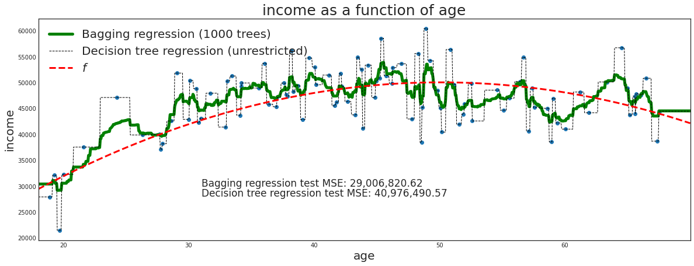{ width=105% }
</center>


# Random Forests
Recall that the intuition from the law of large numbers holds best when the different regressors we use are diverse (going towards independence).

- With the voting regressor, we used different methods to reach diversity
- With the bagging regressor, we used different subsets of our training data to reach diversity.

Random Forests is an ensemble of decision trees that follows the bagging method. However, one simple modification is added to reach greater tree diversity:

- Each time a decision tree in the ensemble attemps to make a split, only a subset of the features are available for consideration.

# Feature Importance
Naturally, when we use a collection of many decision trees we loose interpretability of our features importance in the prediction.

- It is no longer immediately clear which features are most important for our predictions.
- However, it is actually possible to obtain an overall summary of the importance of each predictor.
- We omit the math here, but Sci-kit Learn gives a list that for each feature shows how much in percentage the predictions improved because of it.

# Introduction to Sci-kit Learn
## Random forests in sklearn
- To perform a random forest regression in Sci-kit Learn, we first import the class:
```
from sklearn.ensemble import RandomForestRegressor
```
- Then, we initialize the object specifying our desired hyper parameters:
```
rf = RandomForestRegressor(n_estimators=100,
max_depth=None, max_features='auto', random_state=181,
n_jobs=-1)
```
- Finally, we can fit our model:
```
rf.fit(X,y)
```
- Note that predicting, calculating the test MSE and performing GridSearchCV is done the same way as usual.
- If we wish to get the feature importance, we just execute the following code:
```
rf.feature_importances_*100
```

# Your tasks
